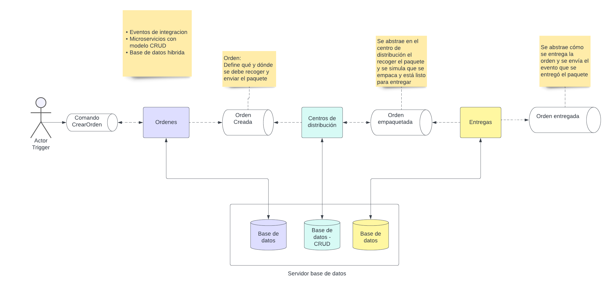

# Not-monolithic-experiments
Entrega 4 para la materia de diseño y construcción de aplicaciones no monolíticas

# Ejecución

## Requisitos
- Docker
- docker-compose
- Python y un ambiente basado en Linux (la libreria pulsar-client[avro] solo esta disponible para sistema macOs y Linux) - Puede utilizar WSL en windows que es el mecanismo que usamos o gitpod
- Instalar las dependencias de python que estan en el archivo requirements.txt, para esto puede crear un ambiente virtual de python nuevo
## Levantar Broker de mensajería
Desde el directorio principal ejecute el siguiente comando.

```bash
docker-compose --profile pulsar up
```

Este comando descarga las imagenes y levanta el broker de eventos pulsar
## Levantar bases de datos
Desde el directorio principal ejecute el siguiente comando.

```bash
docker-compose --profile db up
```

Este comando descarga las imágenes e instala las dependencias de la base datos.
Este va a crear el servidor de base de datos con las bases de datos independientes para cada microservicio

## Microservicio de Ordenes 
Desde el directorio principal ejecute el siguiente comando.
``` bash
flask --app src/ordenes/api run --port=5000
```

Esto va a ejecutar el microservicio de Ordenes
## Microservicio de Centro de distribucion
Desde el directorio principal ejecute el siguiente comando.
``` bash
flask --app src/centrodistribucion/api run --port=5001
```
Esto va a ejecutar el microservicio de Centro de distribucion
## Microservicio de Entregas 

Desde el directorio principal ejecute el siguiente comando.
``` bash
flask --app src/entregas/api run --port=5002
```
Esto va a ejecutar el microservicio de Entregas

## Envio comando de creacion de orden
Desde el directorio principal ejecute el siguiente comando.
``` bash
python src/test-eventos/envio-crearorden.py
```

## BFF: Web

Desde el directorio `src` ejecute el siguiente comando
```bash
uvicorn bff_web.main:app --host localhost --port 8003 --reload
```

### Crear imagen Docker

Desde el directorio principal ejecute el siguiente comando.

```bash
docker build . -f bff.Dockerfile -t ordenes/bff
```

### Ejecutar contenedora (sin compose)

Desde el directorio principal ejecute el siguiente comando.

```bash
docker run ordenes/bff
```

Esto va a publicar un comando en el topico de comandos de eventos con la informacion necesario para crear un evento de alli se realiza la coreografia en una transaccion larga pasando por cada microservicio para entregar la orden

## Overview diagrama arquitectura



# Escenarios de arquitectura
Algunos escenarios fueron modificados debido a que escenarios propuestos en la entrega pasada no reflejaban.


## Escenario Mantenibilidad - Facilidad de integración
Se espera que el sistema sea capaz de integrarse con cualquier sistema tercero en un tiempo menor o igual a 2 meses, para así, poder brindar servicios de cadena de 
suministro interactuando con el sistema integrado.

¿Cómo se cumple?

Existe un desacoplamiento del sistema existente mediante el uso de una arquitectura basada en evento utilizando tópico donde el punto de acoplamiento ahora es la definición de una interfaz en el tópico de Centro de Distribución para recibir eventos de ordenes utilizando un schema Avro completamente versionada, lo cual permite que cualquier nuevo sistema solo deba integrarse utilizando dicho schema con el tópico que es un elemento de infraestructura sin lógica de negocio.

## Escenario Disponibilidad - Resiliencia a particiones
Se espera que después que una orden haya sido recibida esta sea procesada el 99.999% de las veces dado que alguno de los microservicios de ordenes, centro de distribución o entregas no esté funcionando

¿Cómo se cumple el atributo de disponibilidad?

Los microservicios son completamente stateless, asíncronos y por lo tanto desacoplados, por lo cual, podemos particionar el sistema tumbando cualquiera de los microservicios mencionados y ningún Evento/Comando va a perderse, el procesamiento del microservicio puede fallar pero si no se completó los eventos estos no son eliminados y cuando se recupere va a volverse a procesar con lo cual no existe perdida de mensajes y se procesan el 99.999% de los mensajes (Pueden existir edge cases donde incluso la infraestructura colapse por eso se eligen esos SLA)

## Escenario Escalabilidad - Recibir ordenes
Se espera que el sistema frente a un aumento de transacciones de pedidos de 328.000 pedidos por día en temporada pueda procesar la creación de pedidos en menos de 2 minutos el 99.99% de las veces.

¿Cómo se cumple el atributo de escalabilidad?

Al existir un broker de mensajería que es un elemento de plataforma altamente escalable y disponible, para la creación de orden se necesita que el microservicio de ordenes que procesa los comandos de creación de orden pueda escalar, esto es posible con un patrón de una arquitectura orientada a eventos debido a que los componentes consumidores son stateless y se puede configurar políticas de autoescalado horizontal basado en el número de comandos sin procesar que estén el tópico de ordenes.


# Almacenamiento
## Topología de administración de datos
Se utiliza una topología híbrida donde cada servicio tiene su propia base de datos independiente que no se comunica entre sí, lo cual puede ser referido como un namespace, pero coexisten en el mismo servidor, esto debido a la facilidad y flexbilidad para mantener y monitorear los cambios en un único servidor de base de datos.

Esto aplica para los 3 microservicios.
## Capa de datos
Se utiliza un modelo CRUD donde se crean los objetos en la base de datos de cada microservicio y de allí se genera un evento que también se persiste en la base de datos y se publica al tópico de eventos correspondiente, pero el tópico no es persistente y no generamos proyecciones para generar el estado de la base de datos que contiene el estado de la orden.

Esto aplica para los 3 microservicios.

# Actividades realizadas por cada miembro
Miguel y Ayrton: Implementación de microservicio de Entregas utilizando los principios de DDD, con patrones de Comandos y Eventos, eventos de dominio e integración para la comunicación interna dentro del microservicio y externa con el tópico donde se publican los eventos relacionados a que la orden fue entregada, persistencia de los objetos y eventos en la base de datos utilizando CRUD en un mecanismo de unidad de trabajo.

Andres: Implementación de microservicio de Ordenes utilizando los principios de DDD, con patrones de Comandos y Eventos, eventos de dominio e integración para la comunicación interna dentro del microservicio y externa con el tópico donde se publican los eventos relacionados a que una orden fue creada, persistencia de los objetos y eventos en la base de datos utilizando CRUD en un mecanismo de unidad de trabajo.

Pedro: Implementación de microservicio de Centro de distribucion utilizando los principios de DDD, con patrones de Comandos y Eventos, eventos de dominio e integración para la comunicación interna dentro del microservicio y externa con el tópico donde se publican los eventos relacionados a tener una orden lista para entregar, persistencia de los objetos y eventos en la base de datos utilizando CRUD en un mecanismo de unidad de trabajo.

# Servicios desplegados en plataforma local
Para la entrega parcial 4, se ejecuta de manera local utilizando gitpod o en maquina local, mientras que en la entrega 5 se va acabar la implementación de despliegue en la nube.